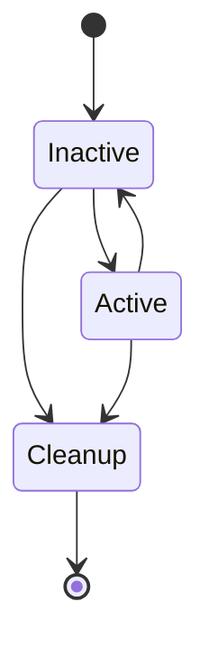
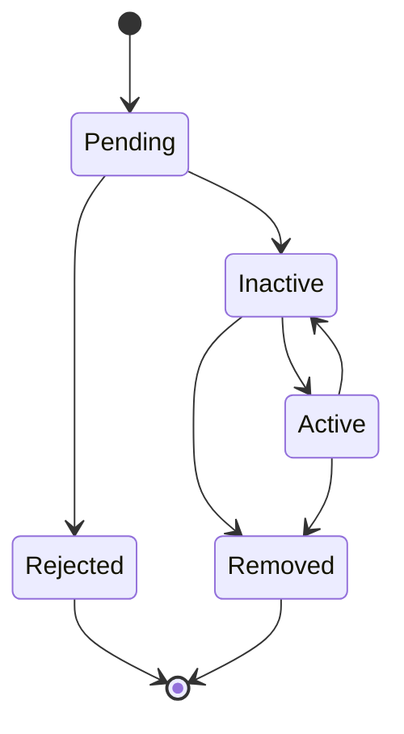

# SockVoteServer
The server component to sock-vote

## Room Lifecycle

| Stage        | Description                  |
| ------------ | ---------------------------- |
| **Inactive** | No admin connection          |
| **Active**   | Active admin connection      |
| **Cleanup**  | The room is being cleaned up |

### Notes
- The room can move from the ``Inactive`` to the ``Cleanup`` stage automatically due to inactivity from the room admin.
- The room can also be manually closed by the admin, moving it from the ``Active`` state to the ``Cleanup`` stage.

## Participant Lifecycle

| Stage        | Description           |
| ------------ | --------------------- |
| **Pending**  | Join request received |
| **Rejected** | Join request rejected |
| **Inactive** | No active connection  |
| **Active**   | Active connection     |
| **Removed**  | Removed from the room |

### Notes
- The ``Removed`` state can be caused by either getting kicked from the room, or the room closing.